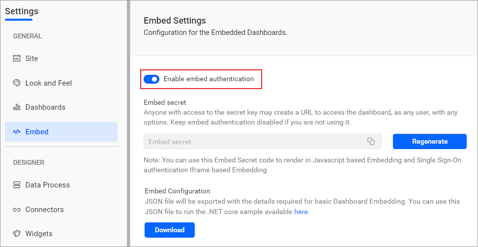
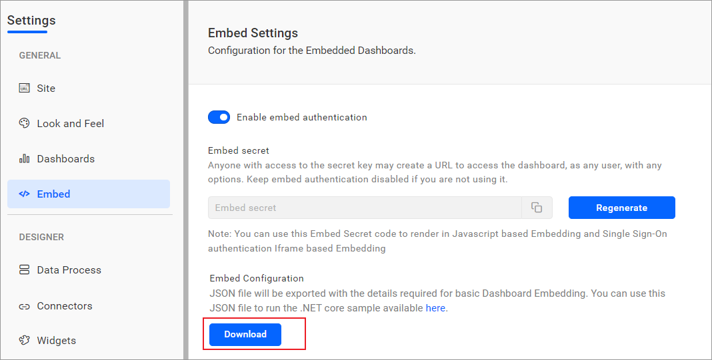
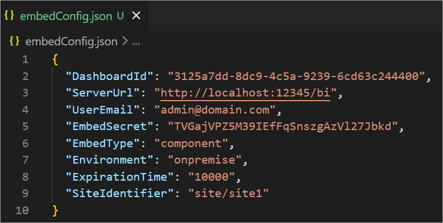
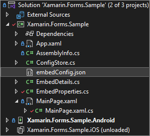
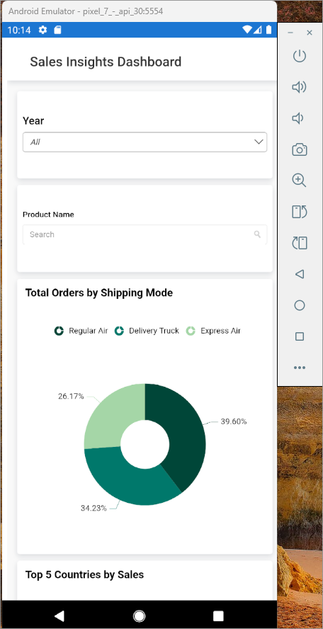

# BoldBI Embedding Xamarin Sample

This Bold BI Xamarin sample repository contains the Dashboard embedding sample. This sample demonstrates how to embed the dashboard which is available in your Bold BI server.

## Requirements

The samples require the following to run:

* [Visual Studio 2022](https://visualstudio.microsoft.com/downloads/)
* [JDK 17](https://www.oracle.com/java/technologies/javase/jdk17-archive-downloads.html)

### Supported browsers
  
* Google Chrome, Microsoft Edge, and Mozilla Firefox.

## Configuration

* Please ensure you have enabled embed authentication on the `embed settings` page. If it is not currently enabled, please refer to the following image or detailed [instructions](https://help.boldbi.com/site-administration/embed-settings/#get-embed-secret-code?utm_source=github&utm_medium=backlinks) to enable it.

    

* To download the `embedConfig.json` file, please follow this [link](https://help.boldbi.com/site-administration/embed-settings/#get-embed-configuration-file?utm_source=github&utm_medium=backlinks) for reference. Additionally, you can refer to the following image for visual guidance.

    
    

* Copy the downloaded `embedConfig.json` file and paste it into the designated [location](https://github.com/boldbi/xamarin-sample/tree/Authorization-master/Xamarin.Forms.Sample/Xamarin.Forms.Sample) within the application. Please ensure you have placed it in the application, as shown in the following image.

   

## Run a Sample Using Visual Studio 2022

* Open the Xamarin sample's solution file `Xamarin.Forms.Sample.sln` in Visual Studio and run it.

    

Please refer to the [help documentation](https://help.boldbi.com/embedded-bi/javascript-based/samples/v3.3.40-or-later/xamarin/#how-to-run-the-sample?utm_source=github&utm_medium=backlinks) to know how to run the sample.

## Online Demos

Look at the Bold BI Embedding sample to live demo [here](https://samples.boldbi.com/embed?utm_source=github&utm_medium=backlinks).

## Documentation

A complete Bold BI Embedding documentation can be found on [Bold BI Embedding Help](https://help.boldbi.com/embedded-bi/javascript-based/?utm_source=github&utm_medium=backlinks).
